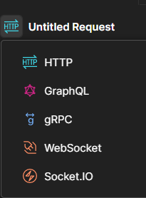
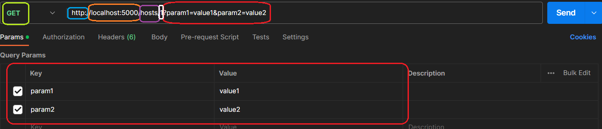
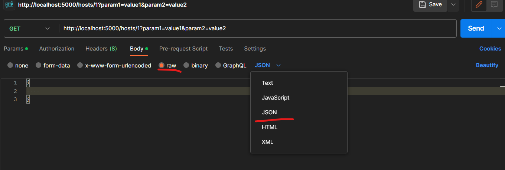
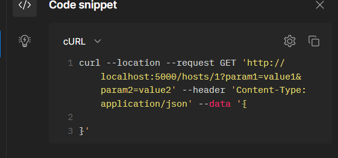
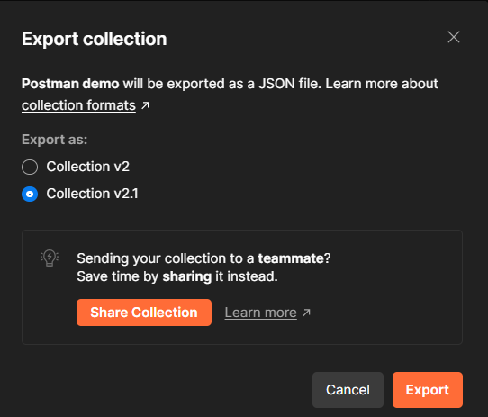
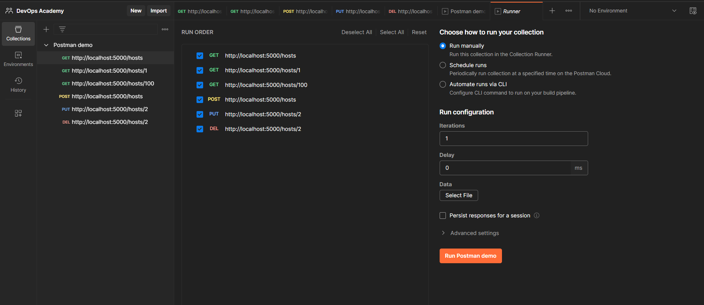

## About Postman

Postman is a powerful API development and testing tool that simplifies the process of working with APIs.  From simple HTTP requests to complex scenarios involving authentication, headers, and payloads, Postman empowers users to explore, validate, and debug APIs, making it an indispensable tool for anyone involved in API development and integration.

### Online vs Desktop
| **Feature**         | **Postman Desktop**                                    | **Postman Online**                          |
| ------------------- | ------------------------------------------------------ | ------------------------------------------- |
| Collaboration       | Supports team collaboration features                   | Collaborative features are available        |
| File Management     | Provides access to local file system                   | File storage and management in the cloud    |
| Performance         | Offers faster response times                           | Response times depend on internet speed     |
| Custom Environments | Allows creation of custom environments                 | Limited support for custom environments     |
| Integration Options | Extensive integrations with various tools and services | Limited integration options                 |
| Pricing             | Free and paid plans available                          | Free plan available                         |
| Localhost Requests  | Supports sending requests to localhost                 | Not supported for direct localhost requests |


### Interface

Postman is not only for web APIs, we can send other requests different from http.



In case of the HTTP protocol we can find the verb, url, parameters, headers and body options.





We also can generate a curl command from our request.



We can save requests into collections so they can be ran and tested in a groupped way. We can also exprot them into JSON files so they can be later imported, given to cli apps, put into our CI/CD workflow etc.





Postman is also a great tool for collaboration, it provides several funcionalities such as commenting, shared workspaces etc.


### Variables
Postman variables offer a powerful mechanism for managing dynamic values in your API testing and development workflows. Here are some examples of how you can use Postman variables in Markdown:

1. Postman Variables:
Postman variables allow you to store and reference dynamic values within your requests, scripts, and tests. Here's an example of how to use a Postman variable within a request:

```javascript
GET \{\{base_url\}\}/users/\{\{user_id\}\}
```

In this snippet, `\{\{base_url\}\}` is a Postman variable that represents the base URL of your API. The value of this variable can be set at different scopes (e.g., global, collection, or local) and shared across requests.

> Note: In the github pages version the {, } brackets are removed so I use escape characters. You should ignore those.

2. Environment Variables:
Environment variables in Postman enable you to define and manage values specific to different environments, such as development, staging, or production. Here's an example of how to set an environment variable:

``` javascript
Environment Variables:
- base_url: https://api.example.com
```

In this code snippet, base_url is an environment variable that represents the base URL for your API in a specific environment. You can switch between different environments and have different values assigned to the same variable, allowing flexibility in your testing and development setups.