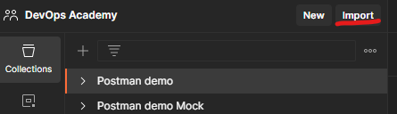
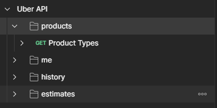

## Open API

### Import OpenAPI (example)
* Download `https://github.com/OAI/OpenAPI-Specification/blob/main/examples/v2.0/json/uber.json`

* Import it in Postman.

* Browse the downloaded json file and click import.

Result:

### Export to OpenAPI
* Export collection to JSON ([relevant section](./about-postman.md#about-postman))

* Convert it with a tool such as
  * [postman-to-openapi](https://joolfe.github.io/postman-to-openapi/)
  * [postman2openapi](https://github.com/kevinswiber/postman2openapi)
