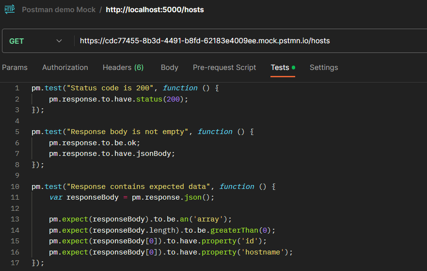
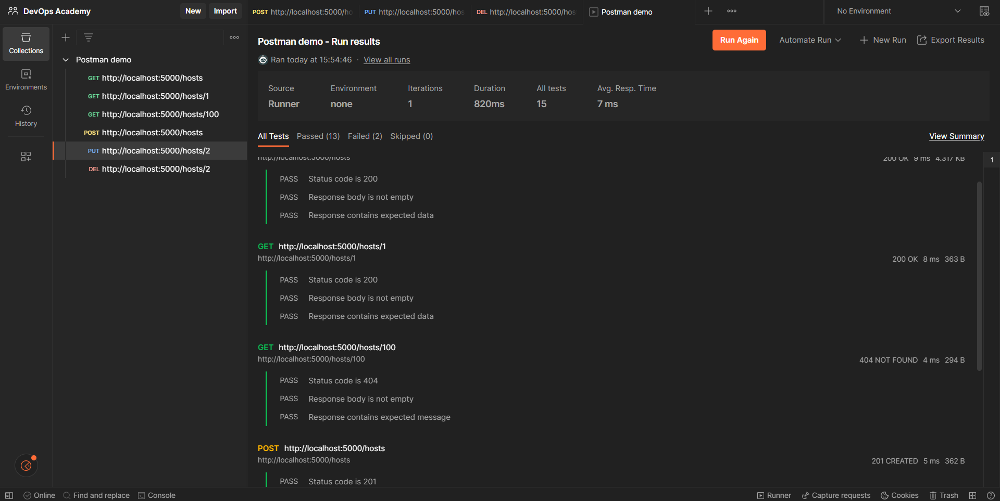
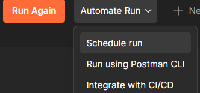
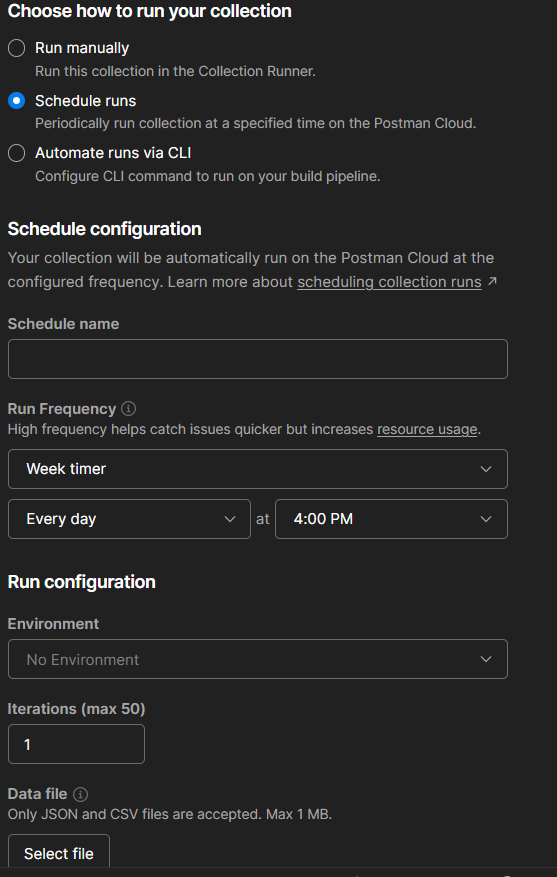
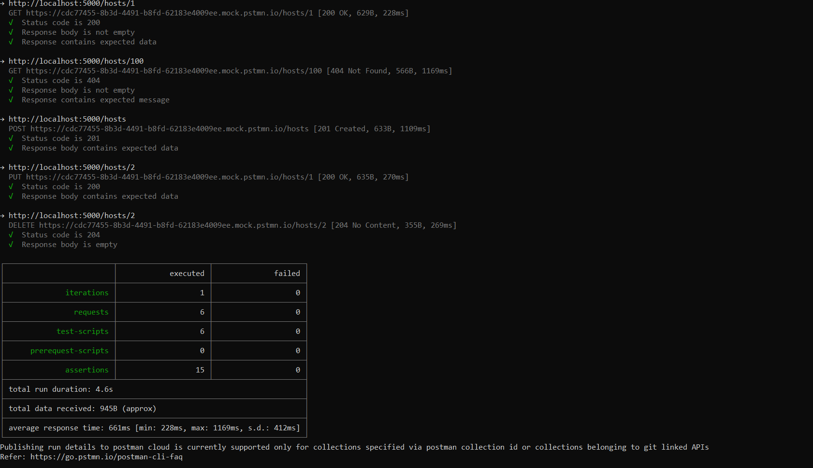
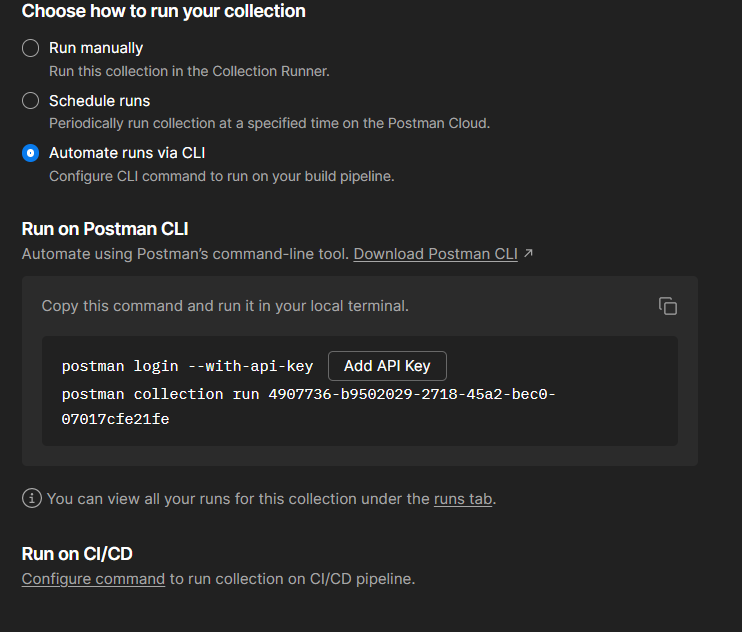
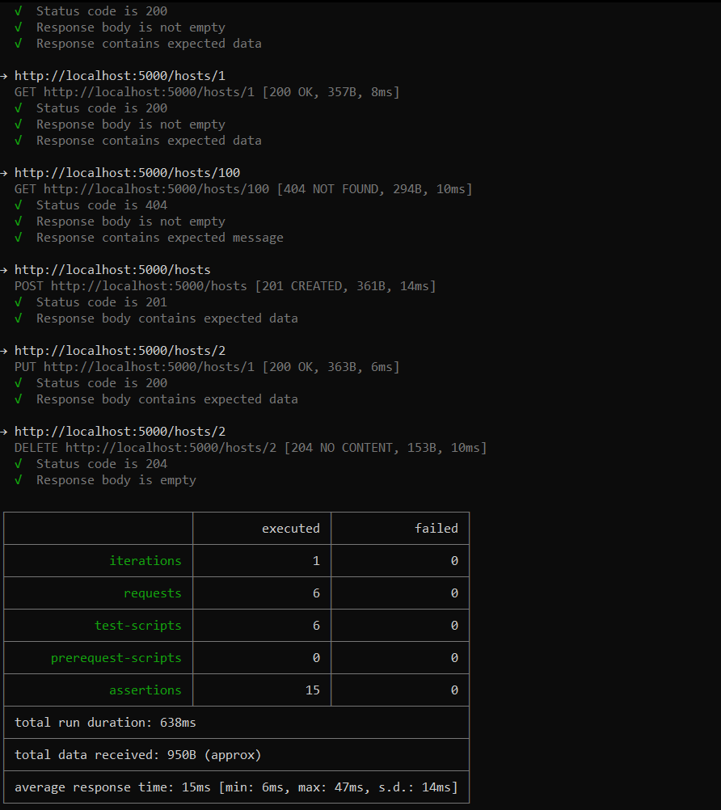
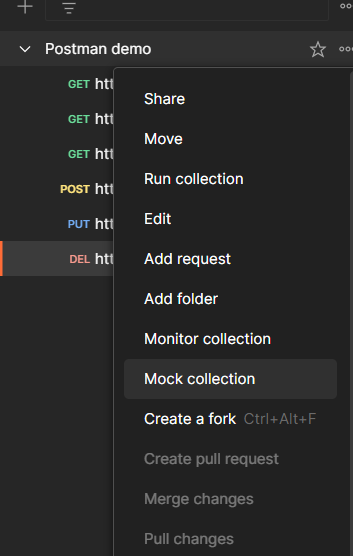
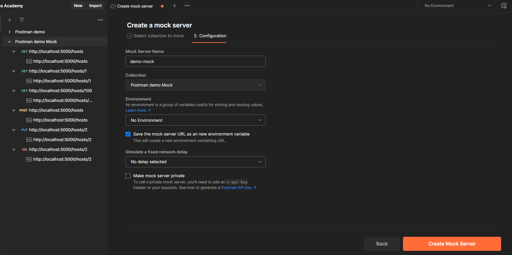
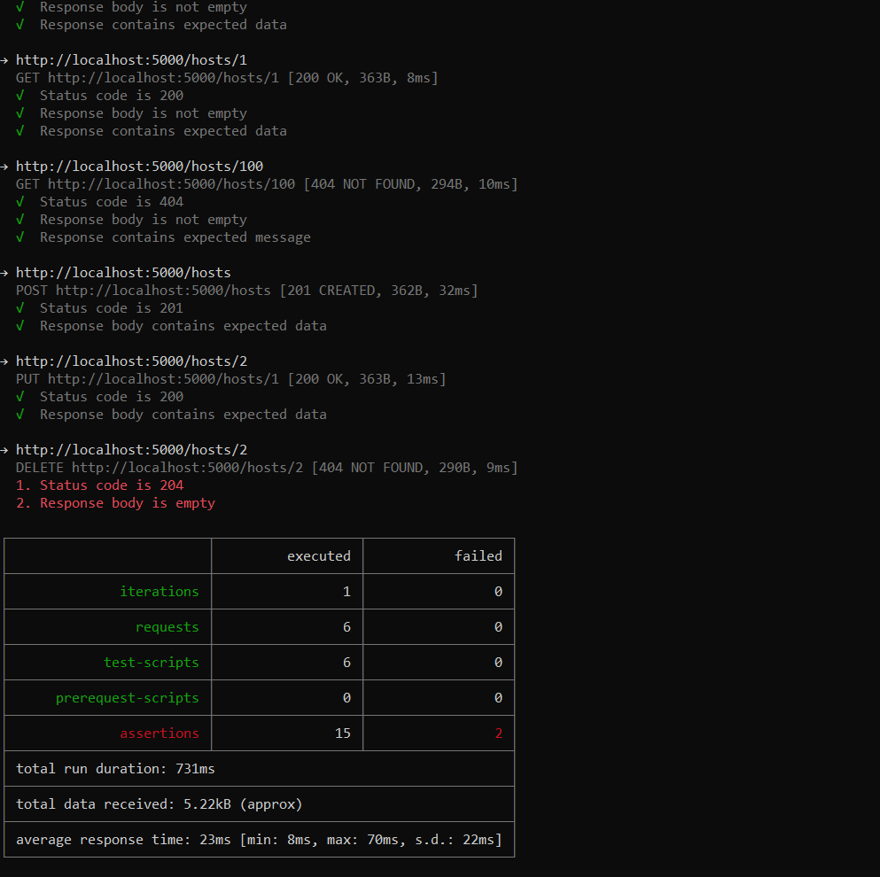

## Tests
Tests can be written in javascript in the `Tests` page.



Sample test for `http://localhost:5000/hosts` API endpoint
```javascript
pm.test("Status code is 200", function () {
    pm.response.to.have.status(200);
});

pm.test("Response body is not empty", function () {
    pm.response.to.be.ok;
    pm.response.to.have.jsonBody;
});

pm.test("Response contains expected data", function () {
    var responseBody = pm.response.json();

    pm.expect(responseBody).to.be.an('array');
    pm.expect(responseBody.length).to.be.greaterThan(0);
    pm.expect(responseBody[0]).to.have.property('id');
    pm.expect(responseBody[0]).to.have.property('hostname');
});
```

Tests are ran with the collections and they show the results.


They can also be executed automatically 



and also with CLI. The CLI version has been Newman for a long time but now Postman CLI is also available with extended and more secure functionality.

|                                                                                                        | Newman      | Postman CLI       |
| ------------------------------------------------------------------------------------------------------ | ----------- | ----------------- |
| Release date                                                                                           | 2014        | 2022              |
| Source Control                                                                                         | Open source | Closed Source     |
| Install                                                                                                | npm         | platform specific |
| Signed by Postman                                                                                      | No          | Yes               |
| Results shown in Postman app                                                                           | No          | Yes               |
| Additional Security                                                                                    |             | More              |
| API key                                                                                                | No          | Yes               |
| export collections, environments, and global variables before completing the execution of a collection | Yes         | No                |
More: https://blog.postman.com/postman-cli-vs-newman/


But the main functionality is the same and have familiar look.

**Newman**


**Postman CLI**



### Mocking
If the server side is not ready but the client side needs some of the endpoints we can configure a Mock server. With this solution we can reply to specific requests with specific results. 




One example shows the difference between using our sample project vs mock server. In our sample project the delete function is implemented in a way that for non-existing ids it returns 404. Our test for the delete is not deterministic because of this. 



But if we use the mock server no actual backend logic happened, we get the same result for every run

